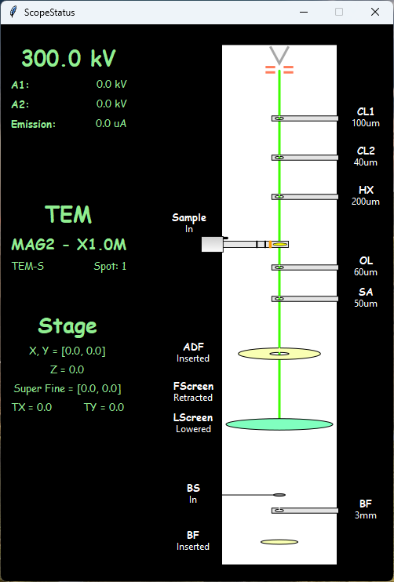

PyJEM program to visually display the current  status of a JEOL TEM (ARM200F or GrandARM300F).

Displays the current condition of the apertures, detectors, beam valve, screen and shows the Gun status. 
The style is intentionally similar to the view in TEMCenterv4 on the JEOL-F200 and is written in Tk.

Note that the programme has been written for the specific configuration of a JEOL GrandARM300F2 at UNSW and the  code may require modification to run on a different microscope. This can be achieved by editing the microscope.py
Please contact if you require help (r.webster@unsw.edu.au). 